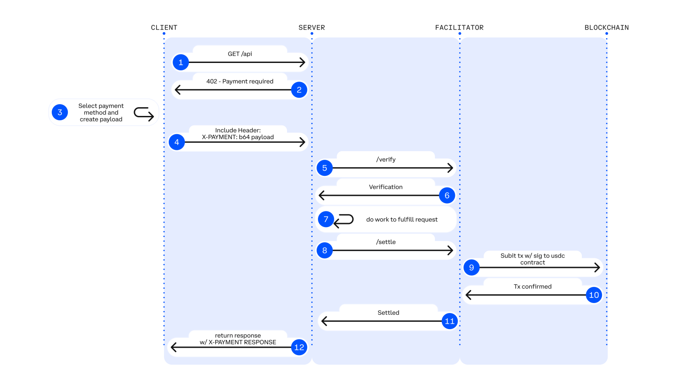
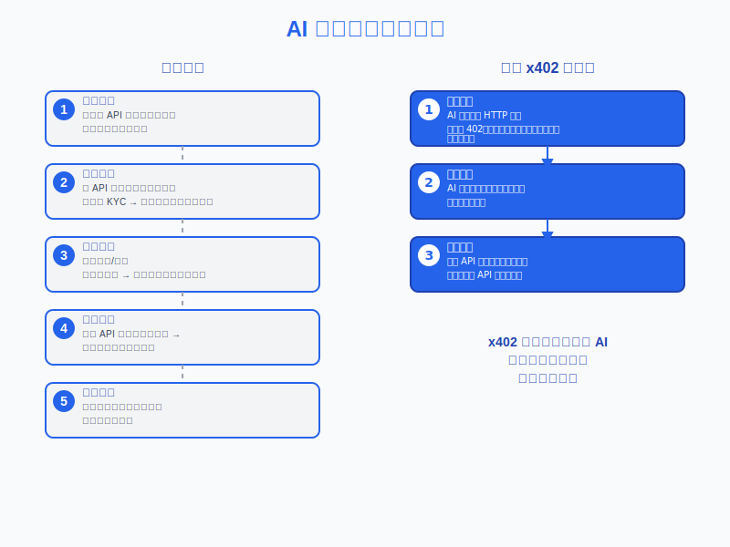

# x402：互联网原生支付的开放标准

### 基于 HTTP 的代理、上下文检索、API 等协议

**作者：**  Erik Reppel, Ronnie Caspers, Kevin Leffew, Danny Organ,  
Dan Kim, Nemil Dalal  

**发布：** Coinbase 开发者平台 / x402  2025年5月6日

---


## 目录

- [1. 动机](#1-动机)
- [2. 链上支付：自治数字经济的基础](#2-链上支付自治数字经济的基础)
  - [2.1 传统支付轨道失效之处](#21-传统支付轨道失效之处)
  - [2.2 通过区块链与数字资产扩展支付](#22-通过区块链与数字资产扩展支付)
- [3. x402 如何工作](#3-x402-如何工作)
  - [3.1 示例集成](#31-示例集成)
  - [3.2 核心支付流程](#32-核心支付流程)
- [4. x402 实现无摩擦支付](#4-x402-实现无摩擦支付)
- [5. 为代理商务构建支付层](#5-为代理商务构建支付层)
  - [5.1 赋予代理自主交易能力](#51-赋予代理自主交易能力)
- [6. 启用新型商业模式](#6-启用新型商业模式)
  - [6.1 实用微支付](#61-实用微支付)
  - [6.2 无缝按用付费变现](#62-无缝按用付费变现)
- [7. 简化支付运营](#7-简化支付运营)
  - [7.1 缓解欺诈、拒付与合规开销](#71-缓解欺诈拒付与合规开销)
  - [7.2 面向未来、链与代币无关的支付](#72-面向未来链与代币无关的支付)
- [8. x402 规范：灵活的 HTTP 支付标准](#8-x402-规范灵活的-http-支付标准)
  - [8.1 中间件配置](#81-中间件配置)
  - [8.2 处理无支付请求](#82-处理无支付请求)
- [9. 技术规格](#9-技术规格)
  - [9.1 支付请求格式](#91-支付请求格式)
  - [9.2 支付授权](#92-支付授权)
  - [9.3 交易结算](#93-交易结算)
- [10. 集成示例](#10-集成示例)
  - [10.1 服务端实现](#101-服务端实现)
  - [10.2 客户端实现](#102-客户端实现)
  - [10.3 钱包集成](#103-钱包集成)
  - [10.4 测试与开发](#104-测试与开发)
- [11. 用例：x402 的现实世界应用](#11-用例x402-的现实世界应用)
- [12. 关键要点](#12-关键要点)
- [13. 参考实现](#13-参考实现)

---

## 摘要

**x402** 是一种开放支付标准，**使 AI 代理与 Web 服务能够自主支付 API 访问、数据与数字服务**。通过利用长期预留的 **HTTP 402 “Payment Required”** 状态码，x402 **消除 API 密钥、订阅与手动支付处理**，实现使用 **USDC** 等稳定币的**实时、机器原生交易**。

**一行代码**，开发者即可集成**按用付费变现**，解锁 AI 驱动应用的**上下文检索与第三方 API 无摩擦支付**。x402 提供**即时结算、接近零费用、链无关灵活性**，成为 **AI 优先商务与机器对机器支付**的理想解决方案。


## 1. 动机

AI 与自治系统的快速发展正在重塑互联网经济，但**实现完全自治 AI 系统的主要障碍之一是缺乏支持 AI 代理无需人类干预即可运行的支付系统**。

传统支付系统主要设计用于人类交互。因此，Web 服务：

- **无法被 AI 代理自主使用**；
- **受限于低效商业模式（如订阅）**；
- **受运营复杂性阻碍**（延迟结算、高交易费、手动开票、易受欺诈与拒付影响）。

这些挑战为 AI 驱动应用与**机器对机器（M2M）交易**带来重大摩擦，阻碍自治数字经济的完全实现。**AI 代理需要即时、无摩擦访问实时上下文数据、API 服务与分布式计算资源**，以独立运行。它们需要**动态、自主执行微交易**，而无需传统支付设置中的人类干预或延迟。

浏览器使用 API 虽尝试解决代理支付的某些需求，但仍依赖为人类用户设计的系统，因此仍受**手动 UX 导航、信用卡依赖、账户验证流程**等人类导向摩擦的负担。

**x402 的终极动机**是**释放自治 AI 系统与代理商务的全部潜力**，构建更高效、无摩擦、可扩展的数字经济。通过启用**机器原生支付**，x402 使 AI 代理能够**自主发现并采购第三方云资源、上下文数据与 API 工具**——无需人类干预即可实现目标优化，加速 **AI 驱动商务的采用与演进**。

---

## 2. 链上支付：自治数字经济的基础

### 2.1 传统支付轨道失效之处

传统支付系统存在**高成本、慢结算、拒付风险**，并需要多层手动设置与授权，使其**不适用于 AI 驱动商务**。

例如：

- **ACH 银行转账**需 1–3 天结算；
- 即使信用卡支付（即时授权）也需数天最终确认，且**可逆转长达数月**；
- 传统系统对**金融普惠构成重大障碍**，约 **14 亿人无银行账户**（来源）。

**x402 填补鸿沟**，使 AI 代理与 API 提供商通过**实时、去信任支付**无缝交互——**消除传统计费系统摩擦**，解锁**新型按用付费收入模式**。

### 2.2 通过区块链与数字资产扩展支付

相较传统轨道，**x402 链上交易在 ~200ms 内结算**，为 API 提供商提供**即时支付确定性**。**无滚动拒付窗口、无结算延迟**——仅实时访问与收入收取。基于**许可开放区块链基础设施**，x402 **全球可用**，无需昂贵转换或传统金融轨道访问。详见 Base.org (2025) 关于链上支付如何变革数字商务的讨论。

x402 通过 **Layer-2 扩展与稳定币**消除低效，实现**低成本、即时、自动化交易**。下表对比 x402 与传统支付方式，展示其为何是 **AI 优先、按用付费模型**的优选。

| **支付轨道** | **典型费用** | **结算最终性** | **拒付风险** | **可扩展性** |
|--------------|--------------|----------------|--------------|--------------|
| 信用卡 | $0.30 + 2.9% | 数天（批量） | 是，最长 120 天 | 65k TPS*（理论最大） |
| PayPal | ~3% + 加价 | 即时授权，数天结算 | 是 | 未知 |
| Stripe（加密支付） | 1.5%+ | 依赖区块链 | 否 - 不可逆 | 依赖区块链 |
| Ethereum L1 | $1–$5 + gas | 1–2 分钟确认 | 否 - 不可逆 | 15–20 TPS |
| **x402（Base 上）** | **免费**（名义 gas < $0.0001） | **200 ms** | **否 - 不可逆** | **数百至数千 TPS** |

---

## 3. x402 如何工作

**x402** 是由 **Coinbase** 开发的**开放支付协议**，使 AI 代理能够**自主完成交易**。基于**链上技术与数字货币（主要为 USDC 等稳定币）**，提供**轻量、安全、即时支付系统**，希望加速 **M2M 支付与代理商务采用**。

x402 协议利用长期预留的 **HTTP 402 “Payment Required”** 状态码，**要求支付以完成 API 请求或加载网页**。若 API 请求无有效支付，x402 返回 **HTTP 402 Payment Required**，提示客户端支付并重试。

通过此简单协议，x402 **消除 API 密钥、账户与订阅需求**。x402 使任何 API 或内容提供商通过**轻量中间件**无缝集成到现有基础设施，接受**按用付费支付**。

### 3.1 示例集成

一行代码，公司即可变现 API、内容与服务：

```js
paymentMiddleware(amount: "0.10", address: "0x...")
```

### 3.2 核心支付流程

1. **客户端请求** – AI 代理或应用请求访问 API 或数字资源。  
2. **需要支付（402）** – 若无有效支付，服务器返回 HTTP 402，提供定价与支付详情。  
3. **代理带签名支付重试请求** – 代理在重试请求中提交签名支付授权。  
4. **Web 服务验证并广播支付** – 服务器验证支付、广播交易并返回 API 响应。

  
**图 1：x402 支付流程：AI 代理 ↔ API 服务器 ↔ 区块链**

---

## 4. x402 实现无摩擦支付

x402 **消除账户与计费摩擦**，实现**无订阅、无预付、无手动开票的真正按用付费访问**。以下展示 **AI 代理与人类用户**如何使用 x402 **即时访问数字服务**：

  
**图 2：对比：现有代理支付流程 vs. x402 按用付费简洁性**

| **场景** | **传统流程** | **使用 x402** |
|----------|---------------|----------------|
| **AI 代理：自治研究助手** | • 需要多个账户订阅用于推理与数据访问。<br>• 设计为人类手动创建账户并设置 API 密钥。<br>• 使用前可能需 API 白名单或批准。 | 1. AI 代理请求市场数据 API<br>2. API 返回 HTTP 402 Payment Required 与成本详情<br>3. AI 代理附加 USDC 支付并重试<br>4. 即时授予 API 访问，立即上下文检索 |
| **人类用户：按文章付费新闻访问** | • 需要账户注册与支付详情。<br>• 强制订阅模式，即使用户只想读一篇。<br>• 用户需手动取消以避免循环收费。 | 1. 用户点击付费墙文章<br>2. HTTP 402 Payment Required 显示 USDC 成本<br>3. 用户在加密钱包确认支付<br>4. 文章即时解锁，无存储信用卡 |

### 访问控制

为进一步增强支付后内容安全与访问控制，x402 可结合**去中心化授权解决方案**，使内容提供商实施**细粒度访问规则**（如单次使用 URL、IP 限制内容流），无需集中式授权服务器。

---

## 5. 为代理商务构建支付层

当今传统支付系统为人类设计——需要信用卡、订阅与手动开票——**与自治 AI 代理、API 与 M2M 交易不兼容**。

随着 AI 系统承担更多自动化决策角色，它们需要**无缝、无摩擦的支付基础设施**，使自治代理能够**快速访问上下文、检索实时数据并在第三方系统执行操作**，无需延迟或人类干预。

### 5.1 赋予代理自主交易能力

AI 模型现可自治运行——但**支付仍是瓶颈**。若无机器原生解决方案，语言模型仍主要依赖人类干预以访问模型外部的上下文与操作。

**x402 消除人类干预需求**，提供**加密原生支付标准**，使 AI 系统能够：

- **无需预注册账户**，按 API 请求、数据查询或 AI 模型推理付费；
- **动态获取实时信息**（如金融市场数据、云资源）；
- **无缝与链上/链下服务交互**，自主触发支付。

这实现**完全自治的 AI 驱动商务**——使目标导向代理在**按需、许可开放经济**中独立运行。

---

## 6. 启用新型商业模式

### 6.1 实用微支付

传统支付轨道基于账户模型，通常需要交易对手间的某种**信任/信用风险**。

这些轨道为人类设计，**不适用于小额、高频交易服务**（如 API 请求）。费用高达 **$0.30/笔**，使微交易不切实际——迫使企业依赖**订阅与捆绑定价**，导致许多潜在消费者放弃使用。

作为支付协议，**x402 使按请求、按服务或按秒计费成为可能**：

- **接近零交易成本**，支持低至 **$0.001/请求** 的支付；
- **真正的按用付费定价**，用于 API、AI 推理与按需内容；
- **M2M 交易**，使 IoT 设备与 AI 代理自主支付资源。

**首次**，企业可规模化盈利支持微支付，为 AI 驱动平台创造**新变现机会**。这得益于 **Base 等 rollup 的低成本与高速度**，以及 **USDC 等与美元挂钩的可信稳定币**。

### 6.2 无缝按用付费变现

在线接受支付传统上意味着**强制用户注册账户、管理 API 密钥、处理手动计费周期**。x402 通过以下方式消除这些障碍：

- **无缝按请求支付**——无订阅、无预付、无锁仓；
- **即时、最终交易**——无拒付、无欺诈风险、无中介；
- **AI 原生变现**——让 AI 代理与人类用户动态支付，无需预批准或 API 密钥。

对开发者和企业而言，这意味着**更高收入、更低成本、无缝支付体验**。

---

## 7. 简化支付运营

### 7.1 缓解欺诈、拒付与合规开销

除交易费外，传统支付系统使企业面临**拒付、欺诈、运营损失与合规开销风险**。使用 x402：

- **支付链上即时结算**，消除拒付与争议；
- **开发者无需 PCI 合规**（除非 Facilitator 选择直接接受卡支付）；
- **不依赖银行或第三方批准**，确保全球、许可开放访问。

通过消除这些障碍，x402 使企业**专注于增长而非支付复杂性**。

### 7.2 面向未来、链与代币无关的支付

x402 设计支持**任何稳定币、数字资产或区块链**——解锁超越传统支付提供商的灵活性。

- 虽然 **USDC 是首批支持资产之一**，但 x402 设计支持**稳定币、数字资产与多条区块链网络**；
- 企业和开发者可选择**最适合其用例的加密货币**，确保最大灵活性。

这种**面向未来设计**确保 x402 将随 **AI 驱动商务扩展而持续演进**。

---

## 8. x402 规范：灵活的 HTTP 支付标准

**x402 中间件**是轻量集成，启用**按请求 API 支付**。以下详述开发者如何配置 x402，以及 AI 代理如何实时处理需要支付的响应。

### 8.1 中间件配置

```js
paymentMiddleware(amount: "0.10", address: "0x...")
```

| **参数** | **描述** |
|----------|----------|
| `amount` | 每次请求成本（如 `"$0.10"`） |
| `address` | 接收支付的钱包地址 |

### 8.2 处理无支付请求

若提交请求无支付，服务器返回 **HTTP 402 (Payment Required)**。响应为 **AI 代理与人类提供结构化反馈**，包括：

```json
{
  "maxAmountRequired": "0.10",
  "resource": "/api/market-data",
  "description": "Access to real-time market data requires payment.",
  "payTo": "0xABCDEF1234567890ABCDEF1234567890ABCDEF12",
  "asset": "0xA0b86991C6218b36c1d19D4a2e9Eb0cE3606EB48",
  "network": "ethereum-mainnet"
}
```

| **字段** | **描述** |
|----------|----------|
| `maxAmountRequired` | 访问所需支付金额（如 $0.10） |
| `resource` | 请求的 API 端点或服务 |
| `description` (可选) | 自定义描述支付详情的消息 |
| `payTo` | 开发者钱包地址（接收支付） |
| `asset` | 交易代币合约地址 |
| `network` | 区块链网络标识符 |

---

## 9. 技术规格

x402 实现 **HTTP 402 响应的标准化方法**，具有支付请求与验证的精确规格。

### 9.1 支付请求格式

当 API 返回 402 响应时，包含以下字段的**结构化 JSON 负载**：

| **字段** | **描述** |
|----------|----------|
| `maxAmountRequired` | 所需最大支付金额（如 `"0.10"`） |
| `assetType` | 代币标准（如 `"ERC20"`） |
| `assetAddress` | 支付代币合约地址 |
| `paymentAddress` | 接收者钱包地址 |
| `network` | 区块链网络标识符（如 `"base-mainnet"`） |
| `expiresAt` | 此支付请求失效的时间戳 |
| `nonce` | 防止重放攻击的唯一标识符 |
| `paymentId` | 此支付请求的唯一标识符 |

### 9.2 支付授权

提交支付时，客户端包含**加密签名消息**，包含：

- 支付请求的所有字段；
- 实际支付金额（必须 ≤ `maxAmountRequired`）；
- 授权时间戳；
- 来自支付钱包的加密签名。

**签名遵循 EIP-712 标准**，在钱包界面中启用清晰、安全呈现。

### 9.3 交易结算

x402 实现可通过多种方法处理结算：

- **链上结算**：直接区块链交易
- **Layer-2 结算**：使用乐观或 ZK rollup 降低费用
- **支付通道**：用于可信方之间高频微支付
- **批量结算**：将多个微支付合并为单笔交易

这种灵活性使开发者可为特定用例与交易量选择**最有效结算机制**。

---

## 10. 集成示例

x402 设计为跨各种编程语言与框架的**简单集成**。

### 10.1 服务端实现

**NodeJS + Express**：

```js
// 安装：npm install @x402/express-middleware
const express = require('express');
const { x402PaymentRequired } = require('@x402/express-middleware');

const app = express();

app.get('/premium-data', x402PaymentRequired({
  amount: "0.10",
  address: "0x1234...",
  assetAddress: "0x2345...", // USDC 合约
  network: "base-mainnet"
}), (req, res) => {
  // 仅在有效支付后运行
  res.json({ premiumData: "Valuable information" });
});

app.listen(3000);
```

### 10.2 客户端实现

**Web 应用使用 x402 客户端库**：

```js
// 安装：npm install @x402/client
import { x402Client } from '@x402/client';
import { connectWallet } from 'your-wallet-connector';

const client = new x402Client();
const wallet = await connectWallet();

// 配置客户端钱包
client.setWallet(wallet);

// 自动处理支付的 API 请求
try {
  const data = await client.fetch('https://api.example.com/premium-data');
  console.log(data); // 高级数据
} catch (error) {
  console.error('支付失败：', error);
}
```

### 10.3 钱包集成

x402 设计与支持**标准签名方法**的任何加密钱包配合。当需要支付时，钱包界面显示确认屏幕，包含：

- 请求域名（如 `api.example.com`）
- 请求支付金额
- 支付代币（如 USDC）
- 正在访问的特定资源

这种透明性确保用户始终清楚支付内容，维持服务提供商与用户之间的信任。

### 10.4 测试与开发

x402 工具包包括**本地开发环境**，含：

- 预加载测试代币的测试钱包
- 实现 x402 协议的模拟 API 服务器
- 模拟各种支付场景的工具
- 详细日志用于调试支付流程

这些工具使开发者**无需连接生产区块链或花费真实代币**即可构建与测试 x402 集成。

---

## 11. 用例：x402 的现实世界应用

以下展示 **AI 代理与人类**在各种场景中使用 x402：

### 代理按需访问 API
- 研究平台启用**按文章付费访问**，消除捆绑付费墙，仅为相关内容付费。
- 视频流媒体服务使用 x402 **按观看秒数收费**，取代传统订阅变现。
- 交易 AI 以 **$0.02/请求** 检索实时股票市场数据，仅在需要时支付。

### 按用付费 AI 模型推理变现
- 计算机视觉 API 以 **$0.005/图像分类** 收费，而非固定企业费用。
- 合成语音 AI 以 **$0.10/音频片段** 收费，启用灵活变现。

### 代理支付云算力与存储
- 自治代理以 **$0.50/GPU 分钟** 购买 GPU 资源，按计算周期付费。
- 目标驱动 AI 模型按需扩展云存储（用于上下文与强化学习），按 GB 付费。

### 代理上下文检索
- 金融 AI 助手为研究支付 **$0.25/高级新闻文章**。
- 法律研究代理以 **$0.10/文件** 访问法院裁决，避免完整数据库订阅。

### 基于创作内容的微支付
- Substack 作家对休闲读者收取 **$0.25/文章**，允许即用即付而非完整订阅。
- 高级研究期刊使用 x402 允许读者**按白皮书下载付费**，而非要求年度会员。
- 高质量播客启用**按集支付**，而非强制月订阅。
- 游戏对用户**按次游玩收费**，而非要求大额购买或依赖广告收入。

使用 x402，**上下文数据提供商**现可无缝变现，结合如 **Model Context Payment (MCP)** 协议的现有框架。

---

## 12. 关键要点

AI 驱动系统的演进需要**与其使用代理一样无缝、自治的支付基础设施**。x402 **消除传统支付轨道摩擦**，实现**无账户、无订阅、无手动计费的实时按用付费交易**。

- **即时、低成本交易**
- **无 API 密钥、无订阅、无中间人**
- **AI 优先、开发者友好、区块链无关**

通过在**协议层标准化支付**，x402 为**更开放、高效、可扩展的数字经济**铺平道路——**AI 代理、开发者与服务提供商可原生、自治交互**。

---

## 13. 参考实现

x402 协议拥有完整**开源参考实现**，包括：

- 处理 HTTP 402 响应流程的**核心协议库**
- 适用于 **Express.js 与 Next.js** 等框架的**服务端中间件**
- **浏览器与 Node.js 环境**的**客户端库**
- **签名与验证支付**的加密工具
- **向各种区块链网络广播交易**的服务

开发者可将这些组件用作**构建块或示例**，在集成 x402 时确保正确遵循协议，同时减少实现工作量。

对于构建下一代 **AI 驱动应用**的开发者，**x402 提供无摩擦、机器原生交易的基础**。

**了解更多：** [x402.org](https://x402.org)

**原文链接：** [x402-whitepaper.pdf](https://www.x402.org/x402-whitepaper.pdf)

---

**翻译说明**：  
- 忠实原文，专业术语统一（如 `agentic commerce` → **代理商务**，`pay-per-use` → **按用付费**）。  
- 表格、代码、图表完整保留并优化 Markdown 可读性。  
- 所有技术细节（EIP-712、JSON Schema、结算方式）精准翻译。  


